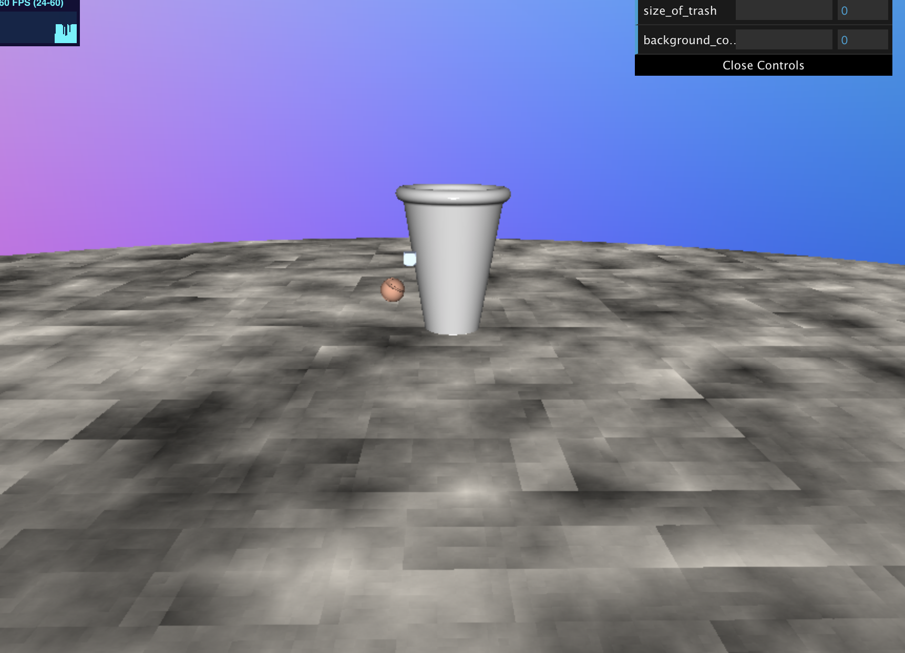

# CIS 566 Homework 2: Implicit Surfaces
## Wendy Sun (wentings)

## Sources

I used all primitives and operations, as well as normal estimation functions from http://www.iquilezles.org/www/articles/distfunctions/distfunctions.htm. I referred to the CIS 460 slides for the raycasting, ray-cube intersections, noise generation and animation toolbox functions. 

## Demo

https://wentings.github.io/hw02-raymarching-sdfs/

(there might be a bug that when you first come to the page, you have to drag down the scene for the objects to show up. This is due to possibly a mistake in the bounding box hierarchy implementation)

## Techniques
I used SDF combination operations Intersection of a box and a sphere and Subtraction between a torus twist and a sphere to make the two trash spheres, and Smooth Blend to combine a rounded cone and a torus to make a trash can. I used Raymarch optimization by way of bounding volumes around SDFs, specifically the scene of trash cans and the scene with the floor. I used the smoothstep and ease-in functions to animate the positions of the two trash spheres. I used FBM to generate a noise function on the floor, and I used Lambert shading with approximated normals of the trash can and the trash balls. Lastly, the GUI is used to control the color of the background and the size of the trash balls.

